# Arena Brawl

**Projekat iz predmeta „Osnove računarske inteligencije"**

## 1. Uvod i motivacija

**Arena Brawl** je 2D borbena igra „jedan na jedan" napravljena u `pygame`-u. Svaki
igrač ima ulogu (*role*) sa jedinstvenom sposobnošću: *Gunner* puca metke, *Bomber* baca bombe,
*Dasher* se "baci" u napred, *ToxicTrail* ostavlja otrovni trag, *Blackhole* postavlja
gravitacione zone.

Cilj projekta **nije** bio napraviti najjačeg bota, već **uporediti kako različiti algoritmi
pojačanog učenja uče istu igru**:

- **PPO** (*Proximal Policy Optimization*) — on-policy actor-critic,
- **DQN** (*Deep Q-Network*) — off-policy, zasnovan na vrednosti,
- **Dueling DQN** — DQN sa razdvojenim tokovima vrednosti i advantage-a,
- **A2C** (*Advantage Actor-Critic*) — jednostavni on-policy actor-critic.

Ključno pitanje: **koji algoritam uči brže, stabilnije i do boljeg konačnog rezultata — i zašto?**

---

## 2. Okruženje

Igru je umotana u standardni `gymnasium` interfejs (`arena_env.py`, klasa `ArenaBrawlEnv`), tako
da svi algoritmi vide **isti** problem.

### Prostor stanja (22 vrednosti)

Vektor stanja je normalizovan na opseg `[0, 1]`:

| Grupa | Vrednosti |
|---|---|
| Moja pozicija | `own_x, own_y` |
| Relativna pozicija protivnika | `opp_rel_x, opp_rel_y` |
| Životni poeni | `own_hp, opp_hp` |
| Cooldown | `own_cd, opp_cd` |
| Moj smer gledanja | `facing_x, facing_y` |
| Odnos dometa | `range_ratio = dist / (2 · attack_range)` |
| Brzina protivnika (ujedno i smer gledanja) | `opp_vx, opp_vy` |
| 2 najbliže opasnosti (pozicija + brzina) | `h1x, h1y, h1vx, h1vy, h2x, h2y, h2vx, h2vy` |
| Da li protivnik nišani u mene | `opp_aiming` |

### Prostor akcija (10 diskretnih akcija)

```python
_ACTION_TO_MOVE = [
    (0, 0),           # 0 — stoj
    (0, -1),          # 1 — gore
    (0, 1),           # 2 — dole
    (-1, 0),          # 3 — levo
    (1, 0),           # 4 — desno
    (-D, -D), (D, -D), (-D, D), (D, D),   # 5-8 — dijagonale (D = √2/2)
    (0, 0),           # 9 — upotreba sposobnosti (napad)
]
```

Jedna odluka agenta = **4 frejma igre** (`frame_skip = 4`) → brže učenje i manja korelacija
uzastopnih stanja.

---

## 3. Inicijalni kurikulum učenja

Prvi pristup: **trenirati agente na punim mečevima 1v1**, sa protivnicima koji **postepeno
postaju teži** (curriculum learning). Ideja je da agent prvo savlada lake protivnike, pa se
težina podiže tek kada dostigne dovoljnu kompetenciju.

**Faze protivnika (od najlakšeg ka najtežem):**

| Faza | Protivnik | Cilj faze |
|---|---|---|
| 1 | `StationaryBot` (stoji, ne puca) | naučiti kretanje i napad bez kazne |
| 2 | `RandomBot` (nasumično kretanje) | pogoditi metu u pokretu |
| 3 | `RandomShooterBot` (nasumično + puca) | uvod u pretnju |
| 4 | `GentleAggressor(0.4)` (juri, puca 40%) | umeren pritisak |
| 5 | `GentleAggressor(0.7)` (juri, puca 70%) | jači pritisak |
| 6 | `EasyBot` (juri i puca) | pun napad |
| 7 | `MediumBot` (kite, strafe, retreat) | taktički protivnik |

Prelazak u sledeću fazu je **uslovljen kompetencijom** (*competence-gated*): faza se menja tek
kada win-rate pređe prag, uz gornju granicu koraka po fazi.

---

## 4. Inicijalni sistem nagrađivanja

Za pun meč koristili smo **direktnu** nagradu (jednostavniju verziju — jednostavnija nagrada je
**naučljivija**). Konstante su na vrhu `arena_env.py`.

**Direktni članovi (ishod):**

| Član | Vrednost | Značenje |
|---|---|---|
| damage given | `+0.3 / hp` | ohrabruje napad |
| damage taken | `−0.1 / hp` | malo, simetrično — da "dodge-only" ne pobedi |
| pobeda / poraz | `±10` | dominantan ishod |
| istek vremena (truncation) | `−3` | Teramo agenta da završi borbu |

**Podsticaji:**

| Član | Vrednost | Značenje |
|---|---|---|
| blizina (jednokratno) | `+0.5` | podsticaj da agent shvati kako da dobija veću nagradu (damage given) |
| izbegavanje (jednokratno) | `+0.5` | nagrada ukoliko agent izbegne "hazard" |
| stajanje u mestu | `−0.005` | agent ne sme da stoji u mestu (mora dase pomeri određeni broj piksela) |
| hit & run | `+0.2` | nagrađuje kajting (hit-and-run) |
| kazna za neagresivnost | `−0.005` | kazna za nepucanje kada je moguće |

```python
# arena_env._step (pun meč)
reward = _R_DAMAGE_DEALT * damage_dealt - _R_DAMAGE_TAKEN * damage_taken
if terminated:
    reward += _R_WIN if winner is self.agent else -_R_LOSE
elif truncated:
    reward -= _R_TRUNCATED
```

> **Lekcija o skaliranju (kako agent iskoristi loš reward system):** ako je „damage dealt" prevelik, optimalno postaje **izbegavati
> svu štetu stajanjem u ćošku**. Zato držimo damage taken/given malim i simetričnim, pobedu/poraz
> dominantnim, a istek vremena se kažnjava.

---

## 5. Algoritmi

Sva četiri algoritma dele **isti ulaz (22)**, **isti izlaz (10 akcija)** i **isto okruženje** —
razlikuju se samo po tome *kako uče*.

### 5.1 PPO (Proximal Policy Optimization)

On-policy actor-critic. Mreža daje logite politike i procenu vrednosti `V(s)`. Advantage se računa
**GAE** (*Generalized Advantage Estimation*):

$$\delta_t = r_t + \gamma V(s_{t+1}) - V(s_t), \qquad
\hat{A}_t = \sum_{l=0}^{\infty} (\gamma\lambda)^l \, \delta_{t+l}$$

PPO optimizuje **klipovani (clipped) surogat cilj** (sprečava prevelike korake politike):

$$L^{CLIP}(\theta) = \mathbb{E}_t\!\left[\min\!\big(\rho_t \hat{A}_t,\;
\text{clip}(\rho_t, 1-\epsilon, 1+\epsilon)\,\hat{A}_t\big)\right],
\quad \rho_t = \frac{\pi_\theta(a_t|s_t)}{\pi_{\theta_{old}}(a_t|s_t)}$$

```python
# ai/ppo_agent.py — ključni deo update-a
ratio = torch.exp(new_log_probs - old_log_probs[b])
surr1 = ratio * advantages[b]
surr2 = torch.clamp(ratio, 1 - clip, 1 + clip) * advantages[b]
policy_loss = -torch.min(surr1, surr2).mean()
value_loss  = mse_loss(values, returns[b])
loss = policy_loss + value_coef * value_loss - entropy_coef * entropy
```

PPO ponavlja učenje kroz **više epoha po jednom rolloutu** (ponovna upotreba podataka unutar rollouta).

### 5.2 DQN (Deep Q-Network)

Off-policy, zasnovan na vrednosti. Mreža procenjuje `Q(s, a)`. Cilj je **Bellman** jednačina sa
zamrznutom *target* mrežom:

$$y_t = r_t + \gamma \max_{a'} Q_{\text{target}}(s_{t+1}, a'), \qquad
L = \text{Huber}\big(Q(s_t, a_t) - y_t\big)$$

```python
# ai/dqn_agent.py
q_values   = online(states).gather(1, actions).squeeze(1)
max_next_q = target(next_states).max(1)[0]
targets    = rewards + gamma * max_next_q * (1 - dones)   # Bellman
loss = HuberLoss(q_values, targets)
```

Istražuje **ε-greedy** (sa verovatnoćom ε bira nasumičnu akciju).

### 5.3 Dueling DQN

Isto kao DQN, ali mreža razdvaja **vrednost stanja** `V(s)` i **advantage akcije** `A(s, a)`:

$$Q(s,a) = V(s) + \Big(A(s,a) - \tfrac{1}{|\mathcal{A}|}\textstyle\sum_{a'} A(s,a')\Big)$$

U stanjima gde izbor akcije ne menja mnogo (npr. izbegavanje kada nema opasnosti u blizini), tok
`V(s)` uči vrednost stanja nezavisno od akcija → efikasnije. **Hipoteza:** prednost Dueling-a nad
običnim DQN treba da bude **veća na izbegavanju nego na nišanjenju**.

### 5.4 A2C (Advantage Actor-Critic)

Najjednostavniji actor-critic: **jedan gradient step po rolloutu**, bez clipping-a i bez reuse-a.

$$L = -\,\mathbb{E}_t\big[\log \pi_\theta(a_t|s_t)\,\hat{A}_t\big]
+ \text{value\_coef}\cdot\text{MSE} - \text{entropy\_coef}\cdot H(\pi)$$

A2C je **sample-hungry** u odnosu na PPO (nema reuse-a), pa je očekivano sporiji na istom budžetu
koraka — što je i samo po sebi rezultat poređenja.

### 5.5 Kako se skupljaju podaci: rollout buffer vs replay buffer

Ovo je **glavni razlog** zašto su ovo dve različite familije algoritama.

**Rollout buffer (PPO, A2C) — on-policy:** skuplja niz *transition*-a `(s, a, r, done, log_prob,
value)` sa **trenutne** politike → izračuna GAE advantage → update → obriše se (*clear*). Zahteva
sveže podatke, pa je **sample-hungry** (baca podatke posle upotrebe).

**Replay buffer (DQN, Dueling) — off-policy:** čuva **veliki "pool" prošlih** *transition*-a
`(s, a, r, s', done)` → uzorkuje nasumične *mini-batch*-eve. Sme da ponovo iskoristi staro iskustvo,
pa je **sample efficient**, ali podaci mogu biti *oudated*.

| | Rollout buffer (PPO/A2C) | Replay buffer (DQN/Dueling) |
|---|---|---|
| tip | on-policy | off-policy |
| sadržaj | sveži transition-i trenutne politike | bazen prošlih transition-a |
| reuse | ne (clear) | da (svaki transition više puta) |
| veličina | ~2048 | 100k–200k |
| posledica | stabilno, ali **sample-hungry** | **sample efficient**, ali sklonije nestabilnosti |

### 5.6 Hiperparametri

| | PPO | DQN | Dueling DQN | A2C |
|---|---|---|---|---|
| learning rate | 3e-4 | 1e-3 | 1e-3 | 7e-4 |
| γ (gamma) | 0.99 | 0.99 | 0.99 | 0.99 |
| GAE λ | 0.95 | — | — | 0.95 |
| clip ε | 0.2 | — | — | — |
| epohe | 4 | — | — | 1 |
| rollout | 2048 | — | — | 256 |
| batch | 64 | 64 | 256 | — |
| replay buffer | — | 100k | 200k | — |
| ε (start→end) | — | 1.0→0.05 | 1.0→0.05 | — |
| anneal (% koraka) | — | 60% | 60% | — |
| target update | — | 1000 | 1000 | — |
| entropy_coef | 0.01 | — | — | 0.01 |
| value_coef | 0.5 | — | — | 0.5 |
| max grad norm | — | — | — | 0.5 |
| gradient steps | — | — | 4 | — |
| warmup | — | — | 10k | — |
| num_envs | 1 | 1 | 16 | 1 |
| loss | — | Huber | MSE | — |

*Zajedničko: state 22, akcije 10, `frame_skip` 4, ukupno 1M koraka.*

**Šta koji radi (i šta ako se poveća/smanji):**

- **learning rate** — koliko se mreža pomeri po gradient step-u. *Previsoka* → nestabilnost,
  oscilacije, divergencija; *preniska* → sporo učenje, zaglavljivanje.
- **γ (gamma)** — koliko se ceni buduća nagrada. *Bliže 1* → dugoročnije planiranje, ali veća
  varijansa; *niže* → kratkovido ponašanje.
- **GAE λ** — kompromis pristrasnost/varijansa u proceni advantage-a. *Bliže 1* → manja
  pristrasnost, veća varijansa; *niže* → obrnuto.
- **clip ε (PPO)** — koliko politika sme da se promeni u jednom koraku. *Veće* → veći koraci, brže
  ali rizik od kolapsa; *manje* → oprezno, stabilno, sporije.
- **epohe / rollout (PPO)** — koliko puta se prolazi kroz iste podatke. *Više epoha* → više uči po
  rolloutu (efikasnije), ali rizik overfit-a na taj rollout.
- **entropy_coef** — koliko se nagrađuje istraživanje. *Veće* → duže istražuje, odlaže
  opredeljivanje (sprečava rani kolaps); *manje* → brže se opredeljuje, rizik prevremenog kolapsa.
- **ε (DQN/Dueling)** — udeo nasumičnih akcija. *Više/duže* → temeljnije istraživanje, ali kasni
  eksploatacija; *premalo prerano* → zaglavi u lošoj politici.
- **replay buffer** — koliko prošlog iskustva se pamti. *Veći* → stabilnije, raznovrsnije, ali
  sporije reaguje na promene; *manji* → brže, ali korelisani uzorci.
- **batch** — veličina mini-batch-a. *Veći* → stabilniji gradijent, sporije; *manji* → bučniji,
  brži.
- **target update (DQN)** — koliko često se osvežava target mreža. *Ređe* → stabilniji ciljevi ali
  sporije prati; *češće* → brže ali nestabilnije.

---

## 6. Problem: zašto smo promenili pristup

Inicijalni pristup (full game + curriculum) **iznova je kolabirao**. Posle 13+ različitih pokušaja učenja i dalje smo bili na početku izrodili su se **„botovi sa jednom akcijom"**: agent bi
pucao ili se kretao u **jednom fiksnom smeru bez obzira na poziciju protivnika** ili njegovo omiljeno **igrao se u ćošku**.

**Zašto je to bilo fatalno baš za naš cilj:** problem nije bio samo „slab bot" — svi algoritmi su
kolabirali **na isti način**. Kada svaki daje podjednako bez razumnu (bez ikakve taktike) politiku, **ne postoji razlika
koju bismo mogli da izmerimo i uporedimo**. A poređenje je bila cela svrha projekta.

**Uzrok** je bila kombinacija previše otežavajućih faktora istovremeno: teško nišanjenje (8 smerova i napad), promenljiv curriculum (7 faza), nasumična uloga protivnika, nagrada sa mnogo članova... Cilj
učenja se stalno pomerao, mi smo se adaptirali na sve poteškoće na koje smo naišli, ali sve je na kraju ponovo bilo isto, jednom rečju → kolaps.

Potrošeno je preko 130 sati na treniranje agenata, ali krajnji rezultat je ostajao gotovo nepromenjen. Naučeni time, odlučili smo se da promenimo pristup problemu.

> **Zaključak koji je pokrenuo preokret:** da bismo *videli razliku između algoritama*, moramo prvenstveno imati nešto gde jasno to možemo i da vidimo (što nismo imali sa inicijalnim pokušajem), moramo im
> dati zadatak dovoljno **jednostavan i stabilan** da bude **naučljiv**

---

## 7. Naučiti agenta najosnovnijim principima igre

Umesto cele igre odjednom, **izolovali smo najosnovnije principe** — *nišanjenje* i *izbegavanje* —
u minimalne zadatke sa sa jednim ciljem i nasumičnošću koja primorava politiku da
**čita stanje**.

### 7.1 Faze osnovnih veština

1. **Nišanjenje — nepokretna meta** (`aim_practice`): meta je `StationaryBot` koji se
   **teleportuje na novu nasumičnu poziciju svaki put kad je pogođen**. Nasumično „respawnovanje"
   je ključno — politika sa fiksnim smerom ne može ništa da skupi, pa je **primorana da čita
   poziciju mete**.
2. **Nišanjenje — pokretna meta** (`aim_move`): meta je `RandomBot` (kreće se); agent mora da
   **predviđa kretanje**. Kreće od naučenih težina prethodne faze (*naučeni .pth fajl - mozak, ubacimo u telo agent*), kako ne bi ponovo morao da uči da puca.
3. **Izbegavanje** (`dodge_practice`): "pokretni strelac" (`AimShooterBot`) puca Gunner metke u
   agenta; agent uči da se kreće tako da ga opasnosti promaše.

### 7.2 Nove, izolovane nagrade

**Nišanjenje — samo naneto oštećenje:**

```
r = _R_DAMAGE_DEALT · damage_dealt          # 0.3
```

**Izbegavanje — samo primljeno oštećenje:**

```
r = − _R_DAMAGE_TAKEN · damage_taken          # 0.1
```

Pošto kontakt sa zidom oduzima HP, kažnjavanje primljenog oštećenja **automatski uči i izbegavanje
zidova** — bez posebnog člana.

### 7.3 Transfer između faza

Svaka povezana faza **kreće od težina prethodne** i fino ih podešava umesto da uči od nule. Upravo ono što smo opisali sa "mozgom" i "telom".

### 7.4 Ispravka ε-anneal-a (raspored istraživanja)

Prvobitni raspored je opadao **geometrijski po epizodi** (`ε ← ε · 0.999`). Pošto su epizode duge
(~1350 odluka), u 1M koraka bilo je samo ~740 opadanja → ε je stigao samo do **~0.14** i **nikada
nije došao do praga 0.05** → agent do kraja bira previše nasumičnih akcija i nikada ne eksploatiše.

**Ispravka — linearni anneal vezan za KORAKE (ne epizode):**

$$\varepsilon(t) = \max\!\Big(\varepsilon_{\text{end}},\;
\varepsilon_{\text{start}} - (\varepsilon_{\text{start}} - \varepsilon_{\text{end}})
\cdot \tfrac{t}{t_{\text{anneal}}}\Big),\qquad t_{\text{anneal}} = 0.6 \cdot T$$

ε linearno pada `1.0 → 0.05` tokom prvih 60% koraka, pa ostaje na 0.05 — čime poslednjih 40%
treninga postaje **eksploatacija**. Ovo je standardni DeepMind raspored (Mnih et al., 2015).

---

## 8. Evaluacija izmenjenog pristupa

### 8.1 Zašto logovi treniranja NISU fer za poređenje

Logovi treniranja se skupljaju *tokom* učenja, pa su "zagađeni" istraživanjem. DQN posebno bira mnogo
nasumičnih akcija, pa njegova treninška nagrada **potcenjuje** stvarnu politiku. Zato:

> Svaki algoritam se evaluira **greedy** (argmax, bez ε i bez uzorkovanja), bez prikaza, na **istim
> seed-ovima**, tako da brojevi odražavaju **samo naučenu politiku**.

### 8.2 Metrike (odnosi/stope — uporedive između uloga)

| Metrika | Značenje |
|---|---|
| `kills/ep` | broj uništenih meta po epizodi (protočnost) |
| `accuracy` = pogodci / hitac | preciznost nišanjenja |
| `aim%` | udeo poteza kretanja **ka meti** (da li čita poziciju) |
| `fire%` | udeo poteza koji su napad (otkriva „spamovanje") |
| `dmg/ep` | primljeno oštećenje po epizodi (izbegavanje; manje = bolje) |
| `wall%` | udeo vremena uz zid (izbegavanje; manje = bolje) |

### 8.3 Rezultati — nišanjenje (nepokretna meta)

**Pogodci po epizodi (`kills/ep`):**

| Uloga | PPO | DQN | Dueling | A2C |
|---|---|---|---|---|
| Gunner | **11.04** | 8.29 | 1.14 | 3.25 |
| Bomber | 2.62 | 6.52 | **8.09** | 0.73 |
| Dasher | 2.24 | 0.12 | 0.31 | **2.67** |
| ToxicTrail | **4.04** | 2.10 | 1.61 | 2.37 |
| Blackhole | 4.37 | 2.31 | 1.24 | **5.40** |
| **prosek** | **4.86** | 3.87 | 2.48 | 2.88 |

U proseku najbolji je **PPO**, pa DQN; po ulogama ima izuzetaka (Dueling najbolji na Bomber-u, A2C na Blackhole-u). **DQN Dasher je kolabirao** (0.12).

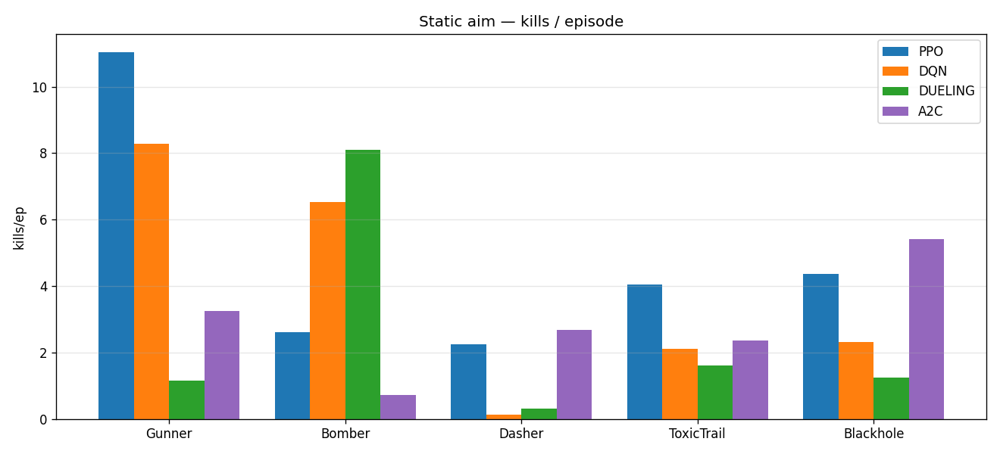
*Slika 1. Nišanjenje (nepokretna meta): `kills/ep` po ulozi (greedy evaluacija).*

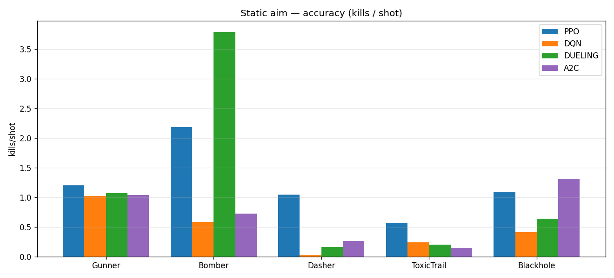
*Slika 2. Preciznost (`kills/shot`): pogodaka po ispaljenom hicu.*

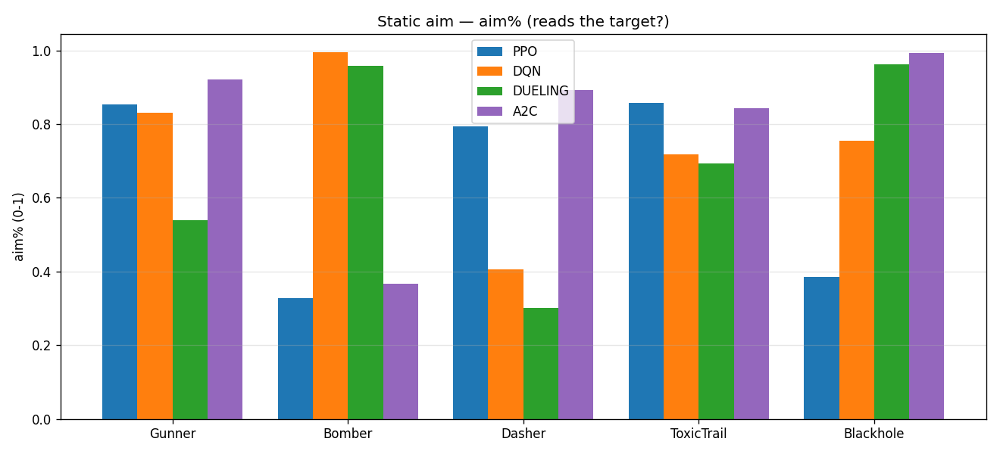
*Slika 3. `aim%`: udeo poteza kretanja ka meti (da li čita poziciju).*

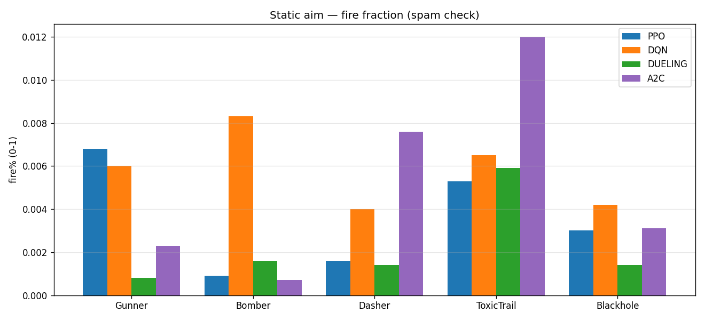
*Slika 4. `fire%`: udeo poteza koji su napad (otkriva „spamovanje").*

### 8.4 Rezultati — nišanjenje (pokretna meta)

**Pogodci po epizodi (`kills/ep`):**

| Uloga | PPO | DQN | Dueling | A2C |
|---|---|---|---|---|
| Gunner | 8.09 | 5.42 | **9.59** | 3.96 |
| Bomber | **3.29** | 1.43 | 0.95 | 2.14 |
| Dasher | **3.56** | 1.09 | 0.98 | 3.03 |
| ToxicTrail | 5.14 | 1.21 | 0.95 | **5.61** |
| Blackhole | **5.71** | 4.99 | 5.61 | 4.71 |
| **prosek** | **5.16** | 2.83 | 3.62 | 3.89 |

**PPO** je najbolji u proseku. Dueling Gunner je izuzetan (9.59), ali Dueling **kolabira na 3 od 5 uloga** (~0.95) — nekonzistentan.

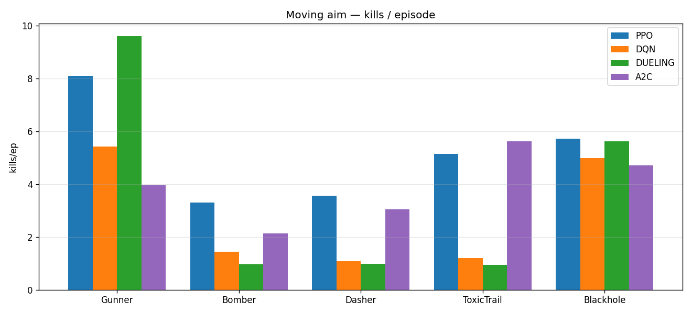
*Slika 5. Nišanjenje (pokretna meta): `kills/ep` po ulozi.*

### 8.5 Rezultati — izbegavanje

**Primljeno oštećenje (`dmg/ep`) i udeo uz zid (`wall%`) — manje = bolje:**

| Uloga | PPO | DQN | Dueling | A2C |
|---|---|---|---|---|
| Gunner | **400 (42%)** | 750 (70%) | 1530 (97%) | 1349 (97%) |
| Dasher | **59 (12%)** | 366 (62%) | 439 (68%) | 252 (78%) |
| ostali* | ~410 (~40%) | ~845 (~74%) | ~1490 (~97%) | ~1345 (~97%) |

\*Bomber/ToxicTrail/Blackhole dele Gunner politiku (izbegavanje je nezavisno od uloge).

**PPO dominira** (upola manje oštećenja, najmanje lepljenja za zid). **Dueling i A2C su kolabirali** na izbegavanju (~97% uz zid): politika se izrodila u kretanje u fiksnom smeru i „zaglavi" uz zid. Izuzetak je **Dasher**, gde svi rade bolje jer *dash* nudi lak beg — A2C nauči *dash*-izbegavanje (Dasher), ali **ne nauči čisto-kretanje izbegavanje** (Gunner).

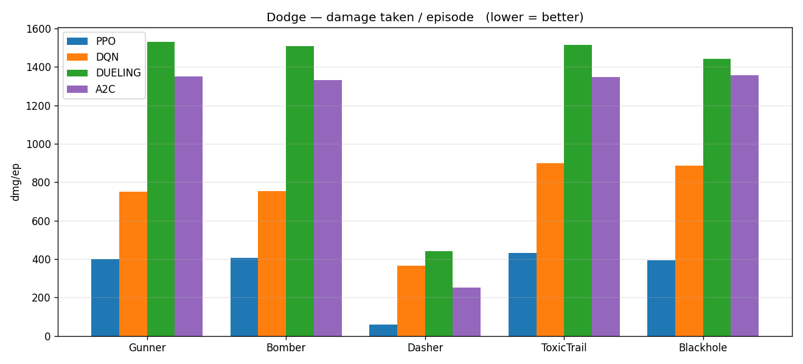
*Slika 6. Izbegavanje: `dmg/ep` po ulozi (manje = bolje).*

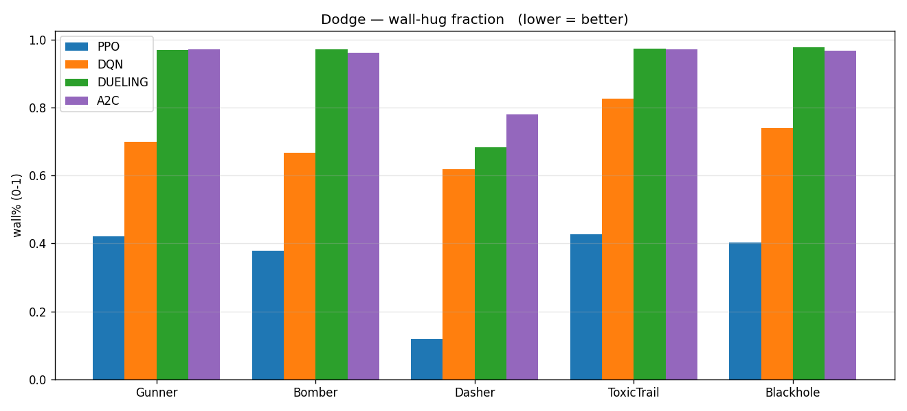
*Slika 7. Izbegavanje: `wall%` — udeo vremena uz zid (manje = bolje).*

### 8.6 Krive učenja (nagrada po epizodi vs koraci)

Prikazuju **brzinu i stabilnost** učenja. Napomena: DQN kriva je ε-zagađena — **rangiranje se čita
sa stubičastih grafika (greedy), a dinamika sa krivih**.

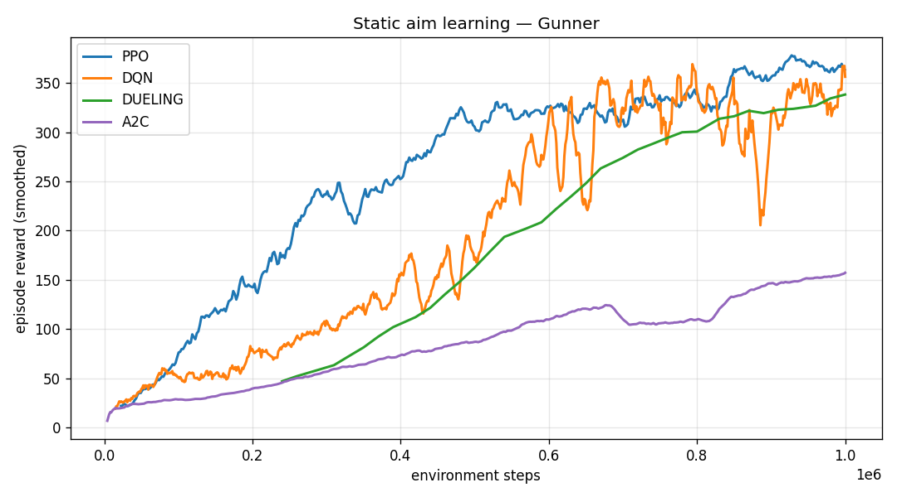
*Slika 8. Nišanjenje (nepokretna) — Gunner.*

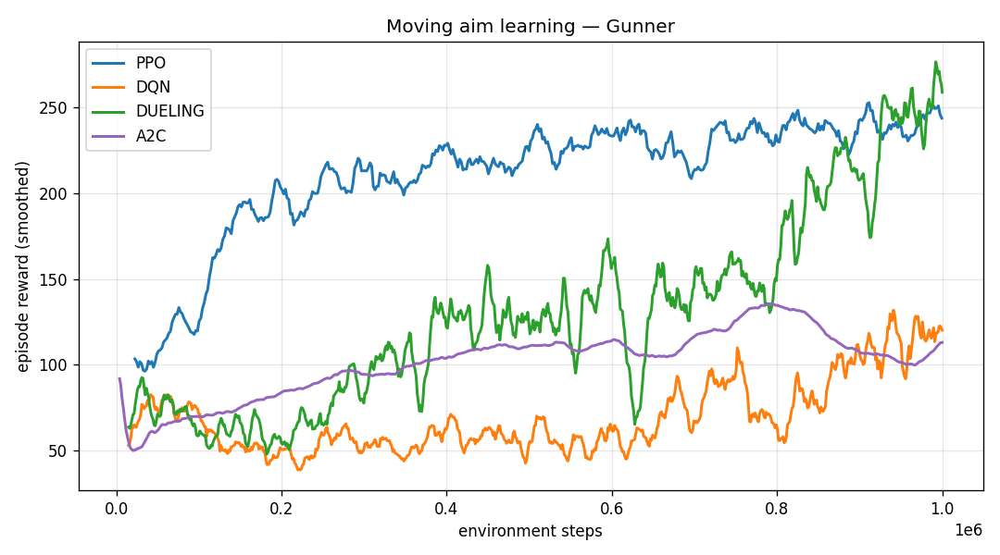
*Slika 9. Nišanjenje (pokretna) — Gunner.*

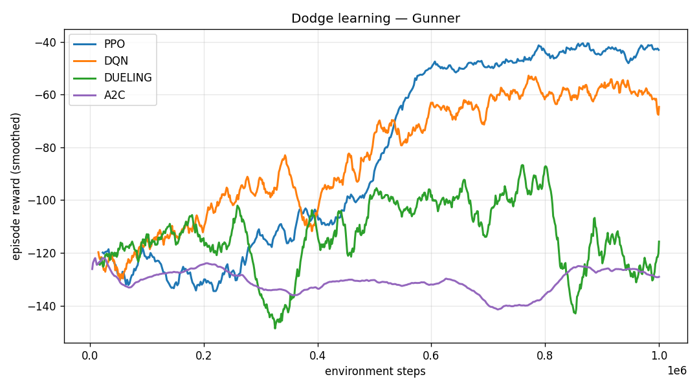
*Slika 10. Izbegavanje — Gunner.*

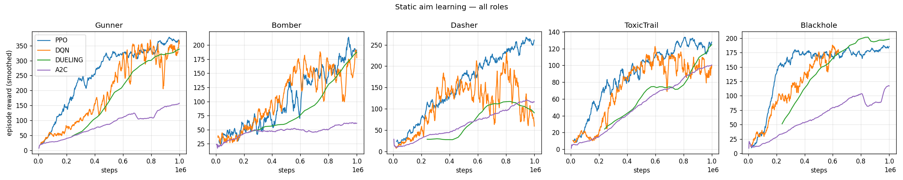
*Slika 11. Nišanjenje (nepokretna) — svih 5 uloga.*

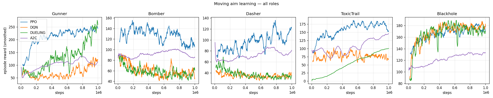
*Slika 12. Nišanjenje (pokretna) — svih 5 uloga.*

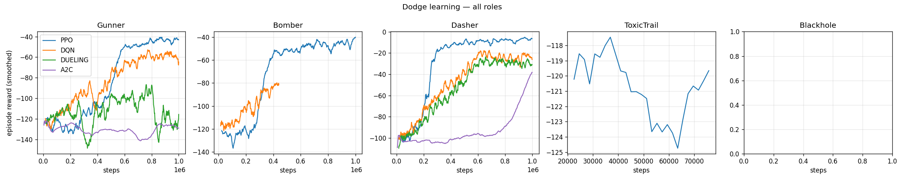
*Slika 13. Izbegavanje — svih 5 uloga.*

### 8.7 Mehanizmi — kako algoritmi rade

Interne veličine iz logova direktno pokazuju **kako svaka familija istražuje i uči**:

- **PPO** (aktor-kritik): entropija politike kreće blizu maksimuma `ln 10 ≈ 2.30` (uniformna) i
  **opada** kako se opredeljuje — implicitno istraživanje; `policy loss` (clipped surogat) + `value loss` (critic).
- **A2C** (aktor-kritik): iste veličine, ali entropija **ostaje visoka** (~2.0) — politika se ne
  opredeljuje dovoljno, što objašnjava njegove slabije/kolabirane rezultate.
- **DQN** (value-based): ε-raspored (eksplicitni prelaz istraživanje → eksploatacija) + TD (Bellman) gubitak.
- **Dueling** (value-based): isto — ε-raspored + TD gubitak; kod izbegavanja je TD gubitak
  **eksplodirao** (divergencija sa MSE gubitkom), što je uzrok kolapsa.

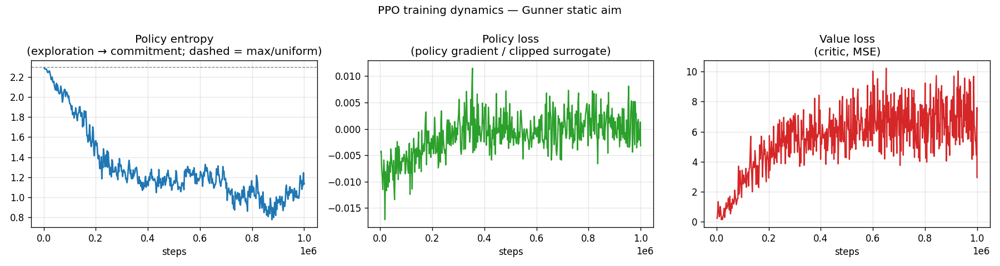
*Slika 14. PPO dinamika (Gunner, nišanjenje): entropija, policy loss, value loss.*

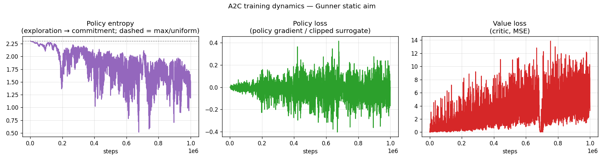
*Slika 15. A2C dinamika: entropija ostaje visoka → slabo opredeljivanje.*

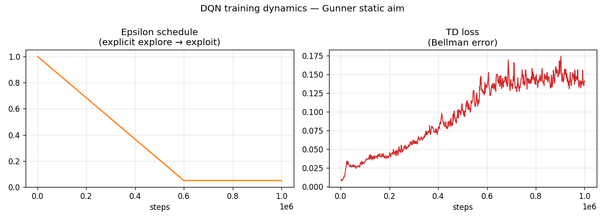
*Slika 16. DQN dinamika: ε-raspored + TD (Bellman) gubitak.*

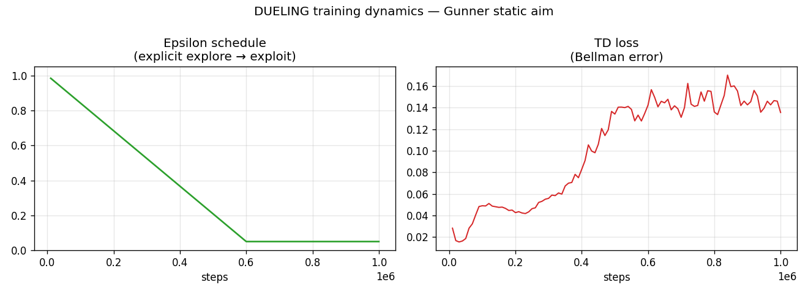
*Slika 17. Dueling dinamika: ε-raspored + TD gubitak.*

> **Suština razlike:** DQN istražuje **eksplicitnim ε rasporedom** i uči **funkciju vrednosti**
> (Bellman); PPO istražuje kroz **entropiju politike** i optimizuje **clipped policy gradient**.

---

## 9. Zaključak

### Glavno

1. **Pojednostavljenje problema je bilo presudno** — tek izolacijom najosnovnijih veština postale su
   razlike između algoritama vidljive i merljive. To je centralni doprinos rada.
2. **Poređenje algoritama** (prosek `kills/ep`; za izbegavanje `dmg/ep`, manje = bolje):
   - *Nišanjenje (nepokretna):* PPO **4.86** > DQN 3.87 > A2C 2.88 > Dueling 2.48.
   - *Nišanjenje (pokretna):* PPO **5.16** > A2C 3.89 > Dueling 3.62 > DQN 2.83 (Dueling Gunner izuzetan 9.59, ali kolabira na 3 uloge).
   - *Izbegavanje:* PPO **~400** < DQN ~750 < A2C/Dueling ~1400–1500 (kolaps, ~97% uz zid); izuzetak Dasher.
   - *Ukupno:* **PPO je najkonzistentniji i najstabilniji** — jedini koji zaista nauči izbegavanje; DQN solidan drugi; Dueling i A2C su nestabilni i kolabiraju na izbegavanju.
3. **Metodološka lekcija:** nagrade su ε-zagađene → pošteno poređenje zahteva **greedy
   evaluaciju** na sačuvanim težinama.
4. **Očekivane tendencije (saglasno sa rezultatima):** PPO stabilan i sample efficient (reuse +
   clipping); DQN sample efficient preko replay-a, ali nestabilniji; Dueling ≈ DQN uz očekivanu
   prednost na izbegavanju; A2C sporiji zbog jednog gradient step-a po rolloutu bez reuse-a.
5. **Trial and error** Potcenili smo dosta samu igru, koliko god izgleda jednostvano, problem je dosta veći ukoliko želimo da naučimo agenta da je igra. Loša inicijalna odluka nas je dovela da na teži način dođemo do zaključaka.

### Budući rad

- **Pun meč:** spojiti nišanjenje + izbegavanje u jednu politiku.
- **Balans uloga:** podesiti sposobnosti tako da „nišanjenje pobeđuje, a spam i predaja gube".
- **Podešavanje da zapravo nauče mehaniku borbe:** zahteva ponovno sagledavanje celokupnog pristupa, promena ulaza i izlaza, kao i ponovno smišljanje treninga i reward sistema".

---

### Dodatak: struktura koda

| Fajl | Uloga |
|---|---|
| `arena_env.py` | RL okruženje, nagrada, `aim_practice` / `dodge_practice` |
| `ai/ppo_agent.py`, `dqn_agent.py`, `dueling_dqn_agent.py`, `a2c_agent.py` | agenti |
| `ai/train_aim_*.py`, `train_aim_move_*.py`, `train_dodge_*.py` | treninzi po fazi × algoritmu |
| `ai/eval_aim.py`, `eval_dodge.py` | greedy evaluacija |
| `ai/plot_comparison.py` | svi grafici poređenja |

### Legacy fajlovi (inicijalni pun-meč pristup, pre ladder rešenja)

| Fajl | Uloga |
|---|---|
| `ai/train_ppo.py` | pun meč + curriculum — PPO |
| `ai/train_dqn.py` | pun meč + curriculum — DQN |
| `ai/train_dueling_dqn.py` | pun meč + curriculum — Dueling DQN |
| `ai/train_league_ppo.py` | self-play / league — PPO |
| `ai/train_league_dqn.py` | self-play / league — DQN |
| `ai/evaluate.py`, `ai/play.py` | evaluacija / igranje protiv trenirane politike u punom meču |